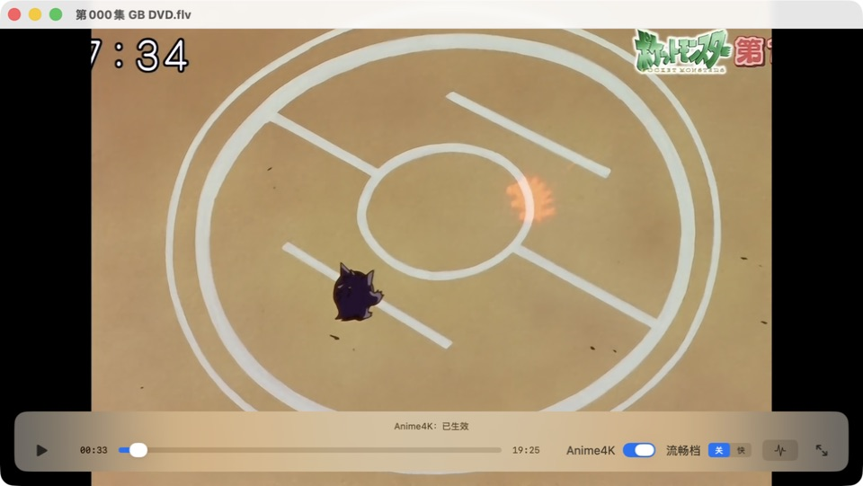
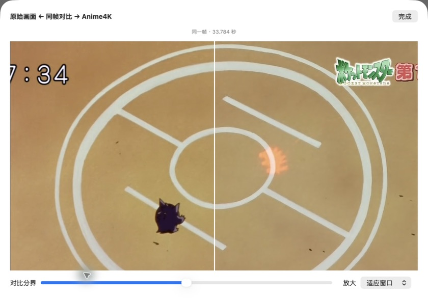
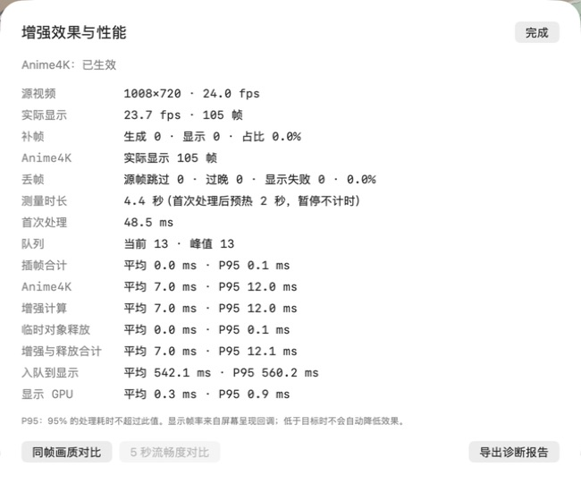

# Hao Player

Mac 上的超轻量本地播放器：一个 App，拖进去就能播。默认 Anime4K，可选流畅档。准备上 Mac App Store。

不是 IINA（通用播放器），不是 Infuse / SenPlayer（媒体库），不是追番套件，也不是 SVP 外挂。

## 界面预览

播放界面：底栏提供进度、Anime4K、流畅档「关 / 快」和全屏控制。



| Anime4K 同帧对比 | 增强效果与性能 |
| --- | --- |
|  |  |
| 拖动分界，查看同一帧的原图与增强结果。 | 查看实际生效状态、处理耗时，并导出本地诊断。 |

截图来自 0.2.3 实际运行；图中的性能数值仅为该次播放示例，持续性能结果见[验收文档](docs/PERF.md)。

## 现在能做什么

- 打开或拖放本地视频；关窗后可从「窗口 → 播放器」或 ⌘0 再打开
- mp4 / mov / m4v 走 AVFoundation；mkv / webm / avi / ts / flv 走自建 LGPL FFmpeg + VideoToolbox
- 默认 Anime4K Fast A 超分，可关
- 流畅档：关 / 快（系统补帧）。性能不足提示掉帧并保留选择；处理失败暂停，由用户重试或关闭失败功能
- 展示实际增强状态、性能详情与本地诊断；支持同帧超分对比和顺序流畅度对比
- 沙盒：只读用户选中的文件，书签续播

字幕还没做。插帧在源分辨率做完再进 Anime4K。高质量档入口已隐藏，内部保留 IFRNet-S 实现用于后续优化；目前持续性能目标尚未达标，详见 [优化报告](docs/reports/2026-09-10-quality-optimization.md)。

## 需要

- macOS 26+，Apple Silicon
- 从源码构建还要 Xcode 26+ 和 [XcodeGen](https://github.com/yonaskolb/XcodeGen)

## 构建

```bash
xcodegen generate
xcodebuild -scheme HaoPlayer -destination 'platform=macOS,arch=arm64' -derivedDataPath build/DerivedData build
xcodebuild -scheme HaoPlayer -destination 'platform=macOS,arch=arm64' -derivedDataPath build/DerivedData test
```

本地运行必须带着沙盒 entitlements。关沙盒测通不算过。完整约束见 [AGENTS.md](AGENTS.md) 和 [docs/ARCHITECTURE.md](docs/ARCHITECTURE.md)。

## 许可

自己的代码 [Apache-2.0](Resources/LICENSES/Apache-2.0.txt)。FFmpeg 仅 [LGPL 2.1](Resources/LICENSES/LGPL-2.1.txt)。Anime4K 与 IFRNet-S 为 MIT。详见应用内「许可证」。
