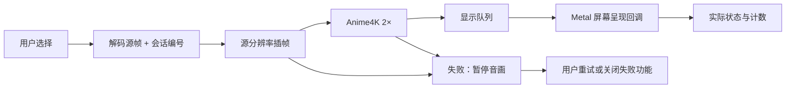

# 增强功能：实现与验收记录

本轮将用户选择、处理结果和屏幕呈现分开记录。开关开启、处理器返回成功、渲染提交成功都不能单独证明增强已经显示。性能结果以本报告最后的完整测量数据为准，不把短测或自动回退当作通过。

## 实现范围

| 项目 | 当前实现 |
|---|---|
| 档位与状态 | 保留用户选择；关闭 / 准备中 / 生效 / 性能不足 / 失败独立显示 |
| 帧信息 | 带会话、源帧/补帧来源、实际插帧算法和 Anime4K 应用信息；跳转/切片/改设置隔离旧帧 |
| 呈现计数 | Metal 正数 `presentedTime` 才计为显示，分别统计生成、提交、真正显示和零回调 |
| 性能指标 | 源帧率、实际显示帧率、补帧占比、完整增强与各阶段均值/P95、队列、丢帧原因、冷启动；暂停停止累计 |
| 失败恢复 | 暂停音画；重试重建失败资源；关闭失败功能后继续需要用户操作；保持暂停后可再次处理 |
| Anime4K | 实际 2× 输出，消除读写同一纹理和循环输出缓冲区过早复用 |
| 快档 | 按系统要求的输入格式，统一使用 VTFrameRateConversion normal；正常结束会话并释放资源 |
| 高质量 | IFRNet-S 图像输入/输出，源分辨率处理，保持 64 像素补边与原裁剪规则，按原生尺寸预热 |
| 过载 | 不改档位；先丢掉过期源帧追到当前播放位置，再恢复相邻帧插帧；明确提示性能不足 |
| 产品对比 | 同一原始帧分割对比及局部缩放；同一 5 秒片段顺序 A/B；临时选择不写入偏好，退出恢复原状态 |
| 本地诊断 | 导出到应用沙盒文稿目录，不新增网络或任意文件写权限 |

## 构建与样本

- M5 Pro，15 核 CPU / 16 核 GPU，48GB，macOS 26.6.2 (25G83)。低电量模式关闭。
- Apple Development / Team M2WM2NJP68，Release，沙盒开启。持续验收是独立应用；`ENHANCEMENT_ACCEPTANCE` 只加入本地测试入口并禁用历史视频续播，使用同一产品播放管线。XCTest 注入的额外权限没有用于本轮正式持续验收。
- 原项目的三项权限保持不变；开发签名自动带 get-task-allow。见 [修复后 entitlements](2026-09-09-enhancement-evidence/gate-pool-entitlements.plist) 与 [构建日志](2026-09-09-enhancement-evidence/build-pool.log)。
- 首轮基线使用内建显示器、固定 60 Hz；测试窗口 960×540 点、2× backing scale。9 月 10 日内存复测结束时系统设置已为 ProMotion，未重新修改；复测开始时没有重新核验固定刷新率，因此复测帧率只作诊断，不作为固定 60Hz 性能通过证据。
- 1080p24/30 来自 Downloads/20260813_124251.mp4（1920×1080），720p24 来自 Downloads/sample_1280x720_surfing_with_audio.mkv（1280×720）。固定帧率的 15 秒片段重复封装至 630 秒，保留音轨。是循环压力样本，不能冒充十分钟长镜头。
- MP4 使用 AVFoundation，MKV 使用 FFmpeg。开发用 ffmpeg 仅生成本地素材，不进入应用运行时依赖。
- 未提交工作树实现；基准 HEAD 为 `5cd3f86fae1d12ee0904584746b87b86c4cbb5c7`。见 [本次源码 SHA256](2026-09-09-enhancement-evidence/source-sha256.json)。没有主动提交、发布或推送。

## 自动回归

59 项通过，0 失败。覆盖性能不足不降档、处理失败暂停、重试重建、显式关闭恢复、旧会话回调隔离、补帧时间顺序、真正呈现计数、暂停计数冻结、输出缓冲区所有权和五轮原生 1080p 快档创建/销毁。GPU 与模型测试实际执行，缺失不会跳过后算通过。见 [测试日志](2026-09-09-enhancement-evidence/tests-final.log)。

## 模型一致性与画质

| 检查 | 结果与边界 |
|---|---|
| 原张量模型 → 图像模型 | 64×64、128×128、1280×768 同输入对照；平均 RGB 误差约 0.25/255，最大 0.562/255，符合原定 MAE≤1、最大≤4 的门槛 |
| 归一化/补边/裁剪 | 保持 RGB / 255、底部与右侧补边、裁回原尺寸；静态色块与非 64 整数尺寸测试通过 |
| Anime4K 非简单放大 | 640×360 → 1280×720，与同输入双线性 2× 放大相比，7.62% 像素存在超过 1/255 的通道差异（最大 53/255）；证明确有不同处理，不等于主观画质必然更好 |
| 已知平移位置 | 左右相差 8px，中间真值为 4px；快档 MAE 0.018，高质量 0.022，重复前帧 2.708，两种算法确实产生了中间运动位置 |
| 保留真实中间帧 | 将真实中间帧留作答案，只向算法提供前后帧；三处纹理/运动样本比较如下 |

[模型转换一致性原始数据](2026-09-09-enhancement-evidence/model-equivalence-final.json) 中的 Python 预测耗时只用于定位，不代替应用端持续测量。

| 片段时间 | 快档误差 | IFRNet-S 误差 | 重复前帧误差 | 结果 |
|---|---:|---:|---:|---|
| 2 秒 | 1.178 | 1.189 | 2.618 | 快档略低 |
| 7 秒 | 1.123 | 1.132 | 2.555 | 快档略低 |
| 11 秒 | 1.883 | 1.874 | 7.065 | 高质量略低 |

Anime4K 的合成高反差矩形边缘可见细亮边和局部暗边，不能把锐化一概当作细节恢复；原图与增强图证据保留在 `synthetic-original.png` / `synthetic-anime4k.png`。新增文字、斜线与棋盘纹理同帧证据：`text-lines-original.png` / `text-lines-anime4k.png`；人物遮挡与硬切仍需扩展素材进行主观验收。

这组三帧来自 24fps 素材，留出中间帧后实际检验的是 12→24fps 重建，不冒充 24→48fps 的真实中间帧验证。

误差为平均每个 RGB 通道的绝对差，范围 0–255，越低越接近保留的真实帧。这三处证据**不能支持“高质量普遍优于快档”**。风景平移、纹理样本也不足以覆盖所有人物遮挡与硬切场景。

| 原始证据 | 真值 | 快档 | 高质量 |
|---|---|---|---|
| 2 秒 | [真值](2026-09-09-enhancement-evidence/2-truth.png) | [快档](2026-09-09-enhancement-evidence/2-fast.png) | [IFRNet-S](2026-09-09-enhancement-evidence/2-quality.png) |
| 7 秒 | [真值](2026-09-09-enhancement-evidence/7-truth.png) | [快档](2026-09-09-enhancement-evidence/7-fast.png) | [IFRNet-S](2026-09-09-enhancement-evidence/7-quality.png) |
| 11 秒 | [真值](2026-09-09-enhancement-evidence/11-truth.png) | [快档](2026-09-09-enhancement-evidence/11-fast.png) | [IFRNet-S](2026-09-09-enhancement-evidence/11-quality.png) |

## 持续性能

修复临时对象释放之前，前六个组合完成了 600 秒测量。该轮存在其他 CPU 高负载任务，以下是当时实测，不代表空闲设备基准；更不代表最终所有组合已达标。

| 组合 | 实测时长 | 显示 fps | 丢帧率 | 增强 P95 | 该轮结论 |
|---|---:|---:|---:|---:|---|
| anime-1080p24 | 600.1s | 23.90 | 0.00% | 17.9ms | 通过 |
| anime-1080p30 | 600.1s | 29.89 | 0.00% | 15.7ms | 通过 |
| fast-1080p24 | 600.1s | 47.63 | 0.34% | 38.6ms | 通过 |
| fast-1080p30 | 600.1s | 56.02 | 6.13% | 43.8ms | 未通过 |
| both-1080p24 | 600.1s | 27.77 | 41.09% | 65.3ms | 未通过 |
| both-1080p30 | 600.0s | 43.92 | 26.16% | 40.4ms | 未通过 |

高质量单开在约 566 秒测量时停止更新，最后内存采样达到 33.66 GiB，未完成 600 秒。调用栈停在 Core Image 输出渲染/内存复制附近；完整证据保留在 [修复前记录](2026-09-09-enhancement-evidence/before-frame-pool/quality-720p24-memory.json) 与 [卡住时采样](2026-09-09-enhancement-evidence/before-frame-pool/hang-sample.txt)。

## 临时对象释放修复（9 月 10 日）

解码在一个贯穿整个播放会话的 GCD 后台任务中循环。原来没有每轮自动释放池，Core ML / Core Image 的临时 Objective-C 对象可能一直积累到后台任务结束。现将读取、增强和输出入队放入每轮 `autoreleasepool`，每次读帧结束即回收临时对象；队列中的帧和插帧所需上一帧仍由强引用持有。不会提前回收正在显示的输出，也不会通过更换算法或缩小分辨率降低内存。

验收程序新增 30 秒稳定期后的内存增长保护：超过初值 2 GiB 则保存诊断并判为异常退出，防止再耗尽系统内存。这只属于测试入口，不改变产品开关或性能不足行为。

修复后使用同一 720p 素材、正常开发签名和沙盒、同一产品处理管线重新测量内存。刷新率核验的边界见上文。高质量单开完整完成 600 秒，随后双开完成 60 秒，应用正常退出，没有触发内存保护。30 秒后的内存采样如下。

| 组合 | 测量时长 | 稳定期范围 | 结束内存 | 实际 fps | 丢帧率 | 增强 P95 |
|---|---:|---:|---:|---:|---:|---:|
| quality-720p24 | 600.1s | 504.5–549.5 MiB | 526.0 MiB | 20.94 | 54.83% | 87.6ms |
| quality-anime-720p24 | 60.1s | 730.3–744.7 MiB | 744.7 MiB | 16.37 | 64.45% | 102.9ms |

[修复后原始测量](2026-09-09-enhancement-evidence/after-frame-pool/summary.json) 与 [每 5 秒内存采样](2026-09-09-enhancement-evidence/after-frame-pool/quality-720p24-memory.json) 保留在本地。单开采样覆盖约 599 秒墙钟时间，帧率测量段完成 600 秒；最后一次内存采样在结束前最多 5 秒，不能将它误写成退出后的占用。

**本轮内存修复通过上述持续播放验证；高质量实时性能仍未通过。** 选择始终为 `quality`，源画面仍为 1280×720，没有降档或缩小模型输入。当前负载下模型计算均值 61.79ms / P95 85.2ms，输入转换均值 0.86ms、输出转换 1.38ms，模型仍是主要耗时阶段。首次完整处理耗时 707.37ms，未藏入稳定期平均值。双开只有一分钟证据，不作十分钟稳定性或实时承诺。

## 尚未完成的验收

- 高质量 720p24→48fps 与部分 1080p 快档组合尚未达到持续性能门槛，内存修复不能替代这些验收。
- 高质量相对快档的普遍画质优势没有得到现有样本支持；人物遮挡、硬切需要补充证据。
- 产品内顺序 A/B 在遮挡窗口时曾得到零呈现计数，已调整为等待对比面板关闭再播放；最新真实界面路径尚待复验。
- 完整的全屏、切片、反复开关、音画同步与长期多轮操作矩阵不能仅凭自动回归宣称全部通过。

## 官方接口依据

- [Apple Metal presentedTime](https://developer.apple.com/documentation/metal/mtldrawable/presentedtime)：以实际呈现回调作为显示证据。
- [Core ML 图像输入输出](https://apple.github.io/coremltools/docs-guides/source/image-inputs.html)：模型直接接收与输出图像缓冲区，减少张量搬运。
